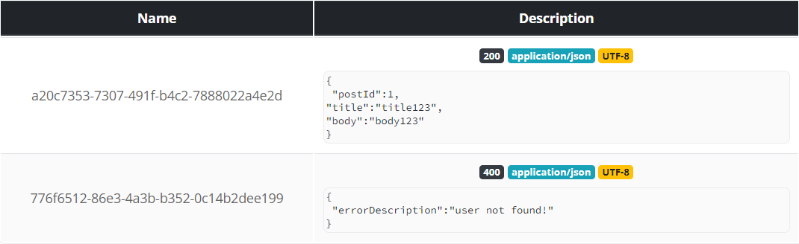

# feign-client-save-requests

## Project Overview

Configuration when the body received from all Feign requests needs to be saved

## Technologies

Java 11 - Springboot - H2 - Spring data JPA - Swagger - Open Feign

## How to test

- Clone the project
- Create a mock server on https://run.mocky.io
    * Create a 200 status code with body
   ```` 
  {
     "postId":1,
     "title":"title123",
     "body":"body123"
  }
  ```` 
    * Create a 400 status code with body
  ```` 
  {
    "errorDescription":"user not found!"
  }
  ```` 
    * copy the Name value below and replace it in value feign parameter in the PostClient.java
    * Example:
  ```` 
  @FeignClient(name = "postClient", url = "https://run.mocky.io/v3", configuration = FeignUserConfig.class)
    public interface PostClient {

  @PostMapping(value = "/a20c7353-7307-491f-b4c2-7888022a4e2d" <----- HERE)
  Post successCall(@RequestBody Post post);

  @PostMapping(value = "/776f6512-86e3-4a3b-b352-0c14b2dee199" <----- HERE)
  Post badRequest(@RequestBody Post post);
  ```` 

- Run it with your IDE
- Import and run the Postman collection
- Access the H2 database http://localhost:8080/h2

```` 
    Driver class: org.h2.Driver
    JDBC Url: jdbc:h2:~/feign-client-requests
    Username and password empty
```` 

- Run a select command in the ERROR_TABLE and SUCCESS_TABLE, you'll see all requests saved
